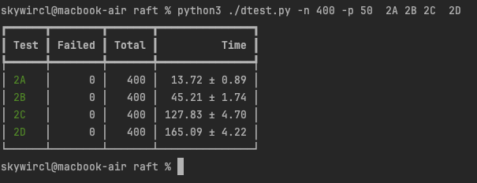

# 通关MIT6.5840(6.824)Lab2 Raft的正确姿势

GitHub仓库：[MadFrey/MIT6.824 (github.com)](https://github.com/MadFrey/MIT6.824)

先上结果：

保证每个测试都单独测试了500次以上，无一 fail。

不保证绝对的 bug-free

最后一起连续测试400次无错误，注意一下测试时同时并发测试的-p参数不要调太高，50-100之间都可以



## 开始前的准备

你需要：

read paper ：[In Search of an Understandable Consensus Algorithm (mit.edu)](http://nil.csail.mit.edu/6.5840/2023/papers/raft-extended.pdf)

其他推荐：[Raft (thesecretlivesofdata.com)](https://thesecretlivesofdata.com/raft/)

测试脚本推荐：[Utility for running MIT 6.824 lab test in parallel and saving failed logs (github.com)](https://gist.github.com/JJGO/0d73540ef7cc2f066cb535156b7cbdab)


在你对raft有基本的理解后就可以开始动手做了，开始你的实验吧！


## Lab2A

个人用时：1天

可以说是本次实验最简单的lab了，lab2a的测试点少，日志量也较小，很容易分析

> 当然如果你是看了自己想到优化或者参考了别人的博客完成了lab2a和lab2b，那么确实lab2c是最简单的，你只要实现一个持久化就行了。但是还是有很多人卡在了lab2C的figure8 (unreliable)上，所以另说

如果你在这里遇到了问题，应该是可以通过再仔细看看论文和日志分析弄出来的，建议耐心一些，因为后面的日志量比这大的多


## Lab2b

个人用时：4天

实现日志增量的复制，这可以说是raft中的一个难点

因为现在有了日志增量，所以选举部分也需要修改，根据日志的长度和最新日志的term来判断是否要投票给候选人

如果候选者的term大于投票者的最新日志的term，那么投票给他

如果term相等，那么就看日志的长度，如果候选者的日志更长，那么投票给他


记得将超时选举时间设置的长一些，我设置的是300ms+随机150ms，如果太短依然有可能fall

所有有共享变量使用的地方，看看要不要加锁，这里建议测试至少1000次以上，将所有的并发问题解决，后面的lab2C和lab2D出问题就大概率不会是代码的并发问题了，减少心智负担，提高时间效率，我自己是测试了1W次，无fall通过

务必查看助教写的[Students' Guide to Raft :: Jon Gjengset (thesquareplanet.com)](https://thesquareplanet.com/blog/students-guide-to-raft/),上面提到的问题如果你都解决了那么通过lab2A和lab2B是没有什么问题的

lab2B的测试条件还是比较宽松的，也没有性能要求，比如你没有实现只能提交最新日志等等都是可以通过所有测试的，但如果是这样的话你进入到lab2C将会遇到我上面说的figure8（un reliable）通不过的情况


## Lab2C

个人用时：3天

恭喜你到了lab2C，如果你能通过2C，那么你基本上可以说是实现了raft了

lab2C中非常重要的一点是实现leader只能提交当前任期的日志，如果你能实现这个，基本上就只剩figure8 /figure8（unreliable）通不过了

并且他的提示应该是 "one(%v) failed to reach agreement"，在这里一般来说就是性能问题了（如果你lab2B所有并发问题都解决了的话）

我当时写完并测试搞了我一天后，发现怎么搞都还是figure8（unreliable）报错，当时也没看博客就自己嗯测，当时就给我恶心到了，并且日志量极大，硬着头皮分析我认为是非常浪费时间的一件事，这样硬测下去肯定不是办法。于是后面几天放松了一下看能不能找到灵感，然后看看别人的博客是怎么解决的，只有晚上会写下lab

我在看博客的过程中得知这是性能的问题，于是从性能上下手

博客说的优化方法： 增加重发，日志的快速回退

如果你没有实现任何的优化，那么

增加重发/提高心跳频率 通过率是20%

继续实现快速回退（助教的博客中说的实现方式），通过率是80%

也就是说测100次会fail 20次左右

最后这20%的性能怎么提升呢？在最后某篇博客中看到有提到异步提交可以提高性能，之前我自己实现的是同步提交的，即来一个事件触发一次提交

修改过后就可以通过lab2C了>_<

所以在前面说到，你如果已经在lab2a或者lab2b时就想到或者参考了别人的博客去实现异步提交，那么在lab2c中应该只需要实现日志的快速回退应该就可以通关了


## Lab2D

个人用时：1-2天

通过lab2C后，你已经实现了raft协议，日志压缩是锦上添花的东西，Lab2的难度也是比较简单的了，工作量大在要修改很多的下标，并且小心一些不要改错，基本就能通过

可能会fail的地方应该就是持久化的时候，要新加上两个快照参数

```go
func (rf *Raft) persist() {
	// Your code here (2C).
	// Example:
	// w := new(bytes.Buffer)
	// e := labgob.NewEncoder(w)
	// e.Encode(rf.xxx)
	// e.Encode(rf.yyy)
	// raftstate := w.Bytes()
	// rf.persister.Save(raftstate, nil)
	w := new(bytes.Buffer)
	e := labgob.NewEncoder(w)
	e.Encode(rf.currentTerm)
	e.Encode(rf.log)
	e.Encode(rf.votedFor)
	e.Encode(rf.lastIncludedIndex)
	e.Encode(rf.lastIncludedTerm)
	raftstate := w.Bytes()
	rf.persister.Save(raftstate, rf.persister.ReadSnapshot())
}
```

相信对经历过lab2b和lab2c的你来说，lab2d不过是小菜一碟。


## 总结

通关用时9天，lab2C那还可以再短一点（如果早点看到这篇博客的话 doge）

在lab2b的时候就使用异步提交，lab2那就一个持久化了，给半天都多了

所以在七天之内完成lab2是可以的

后面寒假还有别的安排，可能做完lab3就先停了吧，等考完研回来再做？maybe


